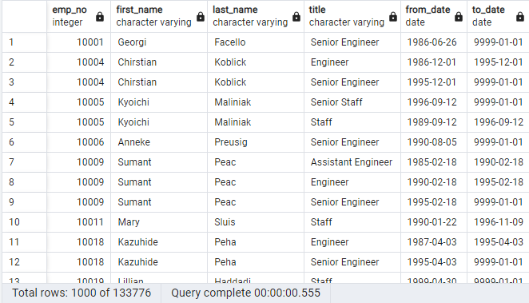
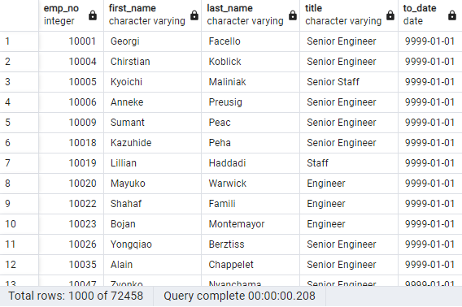
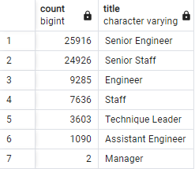
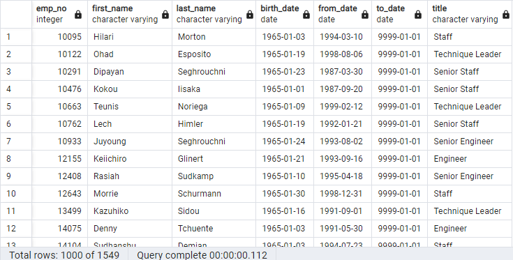

# Pewlett_Hackard_Analysis

Employee database analysis on retiring employees using SQL and pgAdmin

## Overview & Purpose of the Project 
After exploring the Pewlett Hackard company data, creating a database in pgAdmin4 with SQL, sorting and generating lists of employees eligible for retirement by department, I was tasked to determine the number of retiring employees per title, and to identify employees who are eligible to participate in a mentorship program.  This is all to help the manager prepare for the upcoming "Silver Tsunami"--the wave of Baby Boomers retiring out of the workforce.

## Deliverables
## 1: The Number of Retiring Employees by Title

Using the ERD I created in the module as a reference and knowledge of SQL queries, I created a Retirement Titles table that holds all the titles of employees who were born between January 1, 1952 and December 31, 1955. 

Some employees had multiple titles in the database so I used the DISTINCT ON statement to create a table that contains the most recent title of each employee. Thus, removing the duplicates. 

Then I used the COUNT() function to create a table that has the number of retirement-age employees by most recent job title. Finally, because we wanted to include only current employees in our analysis, I was sure to exclude those employees who have already left the company.

## 2: The Employees Eligible for the Mentorship Program

Looking back at the ERD I created in the module and the the tables created for the first deliverable, I created the following mentorship-eligibility table that holds all current employees who were born between January 1, 1965 and December 31, 1965. 

## 3: Analysis

### Results

-  employees leaving, there are 29,414 Senior Engineers, 28,254 Senior Staff, 14,222 Engineers, 12,243 Staff, 4,502 Technique Leaders, 1,761 Assistant Engineers, and 2 Managers.
-Created the mentorship_eligibility table by joining the employees, department employees, and titles tables. In this case, the criterion for the join was that the employees were born in 1965 and that they were currently working at PH, in order for them to apply to the retiring/mentorship package. There were 1,549 employees eligible
-Out of those eligible employees, there are 402 Engineers, 392 Senior Staff, 332 Staff, 290 Senior Engineers, 77 Technique Leaders, and 56 Assistant Engineers.
-

### Summary

Provide high-level responses to the following questions, then provide two additional queries or tables that may provide more insight into the upcoming "silver tsunami."

How many roles will need to be filled as the "silver tsunami" begins to make an impact?

Are there enough qualified, retirement-ready employees in the departments to mentor the next generation of Pewlett Hackard employees?
